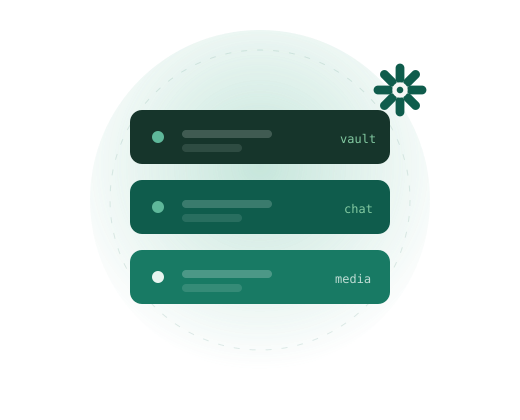
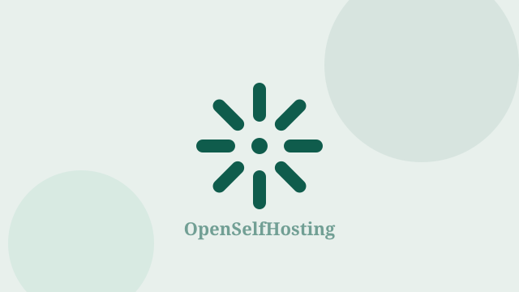
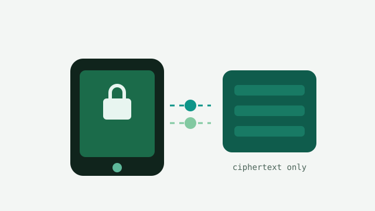
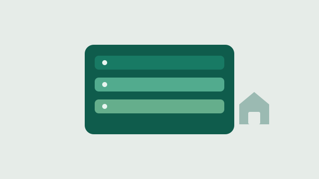

  

<h1 align="center">OpenSelfHosting</h1>

  <strong>Your tools. Your server. Your data.</strong> 
  <em dir="rtl">أدواتك. خادمك. بياناتك.</em>

  We build open-source, privacy-first software you host yourself — 
  end-to-end encryption, no middlemen, and <strong>you hold the keys</strong>.

  

  
  
  

---

## Why we exist

  

Cloud convenience often means surrendering control. **OpenSelfHosting** builds tools where cryptography happens on your devices first, servers store opaque ciphertext, and deployment stays under your roof — home lab, VPS, or LAN.

Self-hosting is not a hobbyist luxury. It is control.

## Principles

  
  &nbsp;&nbsp;
  
  &nbsp;&nbsp;
  

| | Principle | Meaning |
|---|---|---|
|  | **You hold the keys** | Encryption on-device first. The server sees ciphertext only — we cannot read your data even if we wanted to. |
|  | **Run it where you want** | Docker at home, on a VPS, or on a LAN. No vendor lock-in. No mandatory subscription to reach your own data. |
|  | **Open source** | Code you can audit. Review, fork, and contribute — transparency instead of blind trust. |

## Products

  

| | Product | Status | What it is |
|---|---|---|---|
|  | **[OpenKey](https://openkey.openselfhosting.com)** | Live | Zero-knowledge password manager. Master password never leaves the device; the server stores ciphertext only. |
|  | **OpenChat** | In progress | Self-hosted chat with E2EE message bodies. Your server, your keys, your conversations. |
|  | **OpenClipBoard** | Soon | Clipboard sync across your devices through a server you own. |
|  | **OpenGalary** | Soon | Private photo gallery on your own stack — memories stay with you. |

### OpenKey stack

  

| Package | Role |
|---|---|
| Flutter app | Android, iOS, desktop clients |
| FastAPI server | Zero-knowledge sync API + PostgreSQL |
| Browser extension | Chrome / Firefox (MV3) |
| CLI | Secrets, password generation, sync |
| Docs | Product site & guides (multi-locale) |

## Quick links

  

- Website: [openselfhosting.com](https://openselfhosting.com)
- OpenKey: [openkey.openselfhosting.com](https://openkey.openselfhosting.com)
- Organization: [github.com/OpenSelfHosting](https://github.com/OpenSelfHosting)

## Contributing

Contributions are welcome — code, docs, translations, and security reviews.

1. Open an issue to discuss larger changes.
2. Fork the relevant repository and open a pull request.
3. Prefer clear commits and a short description of *why* the change exists.

For vulnerability reports, use each product’s `SECURITY.md` when available. Do not open public issues for sensitive security findings.

## License

Unless otherwise noted, projects under this organization are released under the **MIT License**.

---

  

  Built for people who want privacy without giving up usability. 
  <a href="https://openselfhosting.com">openselfhosting.com</a>

